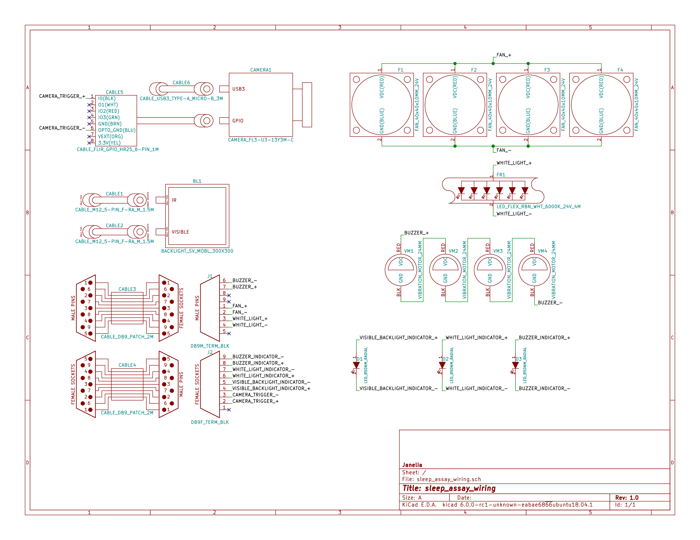

- [Repository Information](#org17cc2b7)
  - [Description](#org25f2af7)
- [Images](#orgbd487b0)
- [Schematic](#org24d9f54)
- [Gerbers](#orga8e82bf)
- [Bill of Materials](#org2419cb1)
  - [PCB Parts](#orgecc567f)
  - [Supplemental Parts](#org83d5030)
  - [Vendor Parts Lists](#orgbc562f7)
- [Supplemental Documentation](#org4d8f16b)
  - [Assembly Instructions](#orgd996ac2)

# Repository Information

-   **Name:** sleep\_assay\_wiring
-   **Version:** 1.0
-   **License:** Open-Source Hardware
-   **URL:** <https://github.com/janelia-kicad/sleep_assay_wiring>
-   **Author:** Peter Polidoro
-   **Email:** peterpolidoro@gmail.com

## Description

# Images

# Schematic

[./schematic/sleep\_assay\_wiring.pdf](./schematic/sleep_assay_wiring.pdf)

# Gerbers

# Bill of Materials

## PCB Parts

| Item | Reference(s)    | Quantity | PartNumber     | Vendor            | Description                                                     |
|---- |--------------- |-------- |-------------- |----------------- |--------------------------------------------------------------- |
| 1    | BL1             | 1        | MOBL\_300x300  | smartvisionlights | Maximum Operating Backlight 300x300                             |
| 2    | CABLE1 CABLE2   | 2        | 277-8345-ND    | digikey           | CBL FMALE RA TO MALE 5POS 1.5M                                  |
| 3    | CABLE3 CABLE4   | 2        | 1195-7211-ND   | digikey           | CABLE ASSY DB09 SHLD BEIGE 2M                                   |
| 4    | CABLE5          | 1        | ACC-01-3000    | flir              | FLIR camera 8 pins 1m GPIO Cable Hirose HR25 Circular Connector |
| 5    | CABLE6          | 1        | GC14333-ND     | digikey           | USB3.0-A-USB3.0-MICRO-B 3M GOLD                                 |
| 6    | CAMERA1         | 1        | FL3-U3-13Y3M-C | flir              | 1280x1024 150 FPS Mono                                          |
| 7    | D1 D2 D3        | 3        | 751-1213-ND    | digikey           | EMITTER IR 850NM 100MA RADIAL                                   |
| 8    | F1 F2 F3 F4     | 4        | 381-2367-ND    | digikey           | FAN AXIAL 40X10MM 24VDC WIRE                                    |
| 9    | FR1             | 1        | 289-1240-ND    | digikey           | LED FLEX RIBBON 24V WHT 4M                                      |
| 10   | J1              | 1        | 277-2667-ND    | digikey           | CONN DSUB PLUG 9POS STR TERM BLK                                |
| 11   | J2              | 1        | 277-2668-ND    | digikey           | CONN DSUB RCPT 9POS STR TERM BLK                                |
| 12   | VM1 VM2 VM3 VM4 | 4        | 1670-1026-ND   | digikey           | VIBRATION MOTOR CYL 5V WIRE                                     |

## Supplemental Parts

| Item | Quantity | PartNumber  | Vendor  | Description                    |
|---- |-------- |----------- |------- |------------------------------ |
| 1    | 3        | 492-1782-ND | digikey | LED HOLDER PNL CLIP 5MM BK NYL |
|      |          |             |         |                                |

## Vendor Parts Lists

[./bom/digikey\_parts.csv](./bom/digikey_parts.csv)

[./bom/flir\_parts.csv](./bom/flir_parts.csv)

[./bom/smartvisionlights\_parts.csv](./bom/smartvisionlights_parts.csv)

[./bom/supplemental\_digikey\_parts.csv](./bom/supplemental_digikey_parts.csv)

# Supplemental Documentation

## Assembly Instructions
